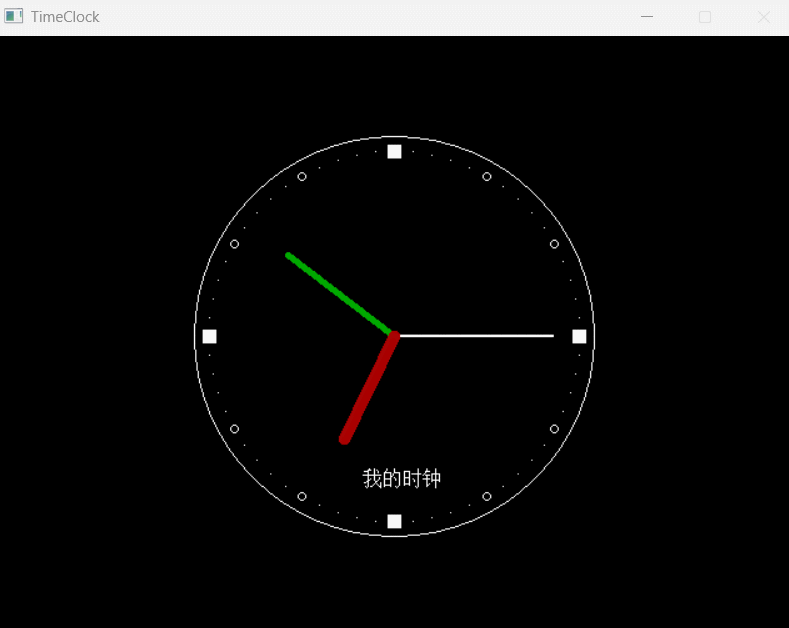

## TimeClock

### 介绍

基于`Easyx`和`visual studio`的钟表程序，为了还原中学时课本上的一个`VB`开发的钟表。用C++库做了实现

### 软件架构

1. 绘制一个简单的表盘
2. 画刻度
3. 获取时间， 画指针，然后休眠以后擦掉指针
4. 最后获取消息，如果鼠标消息到达关闭软件

具体可看代码

### 安装教程

1.  下载本软件，双击运行
2.  或者克隆项目，用`visual studio`打开
3.  前提一定要安装`Easyx`
4.  注意编码问题，如果编码不一致会出错。

### 使用说明

1.  点击文件运行
2.  双击钟表退出程序

运行结果示例

### 参与贡献

有问题可以直接提issue，或者邮件提醒我